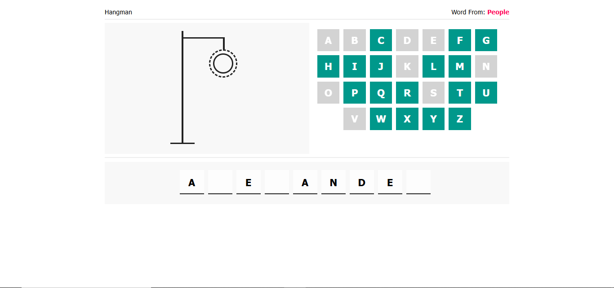

# Hangman Game

## Welcome! 👋

## Table of contents

- [Overview](#overview)
  - [Links](#links)
- [My process](#my-process)
  - [Built with](#built-with)
  - [Useful resources](#useful-resources)
  - [Still in progress](#still-in-progress)
- [Author](#author)
- [Acknowledgments](#acknowledgments)

## Overview

### Links

- Live Site URL: [Live Site](https://ilham-bouk.github.io/Hangman_Game/)

## My process

### Built with

- Semantic HTML5 markup
- CSS custom properties
- JavaScript 
- Disktop-first workflow

### Still in progress

 - Win function. 
 - Effects (sounds, winner effect like sprinkles background). 
 - Tablet and Mobile responsive design. 
 - Some futures (timer, levels...). 
 - Add start game and choose the level option. 

### Useful resources

- [MDN Web Docs](https://developer.mozilla.org/en-US/docs/Web/CSS/)

## Author

- Frontend Mentor - [@ilham-bouk](https://www.frontendmentor.io/profile/ilham-bouk)
- LinkedIn - [Ilham Bouktir](https://www.linkedin.com/in/ilham-bouktir-0b266b31b)

## Acknowledgments

A big thank you to anyone providing feedback. It definitely helps to find new ways to code and find easier solutions!

**Happy coding!** ☺️🚀
